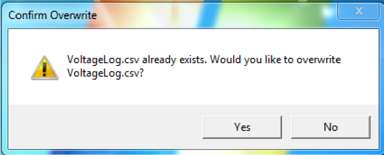
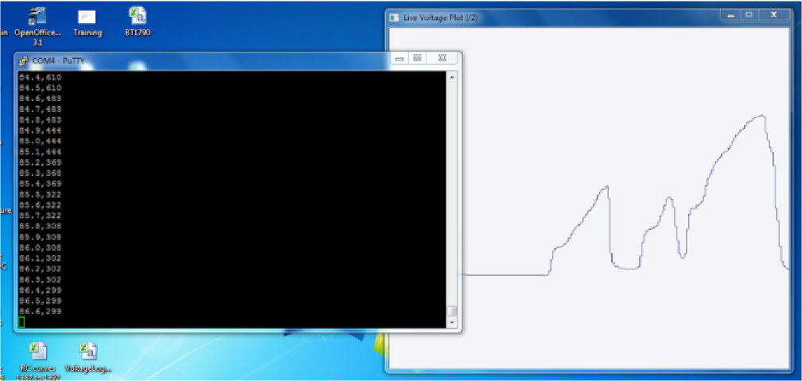
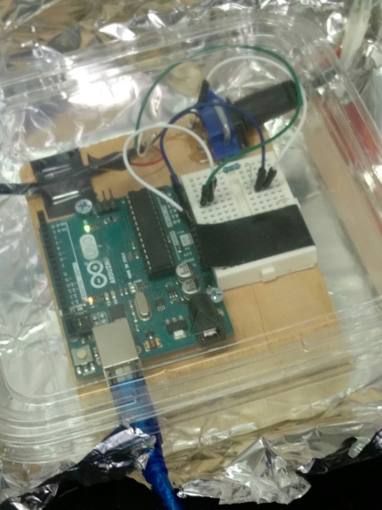
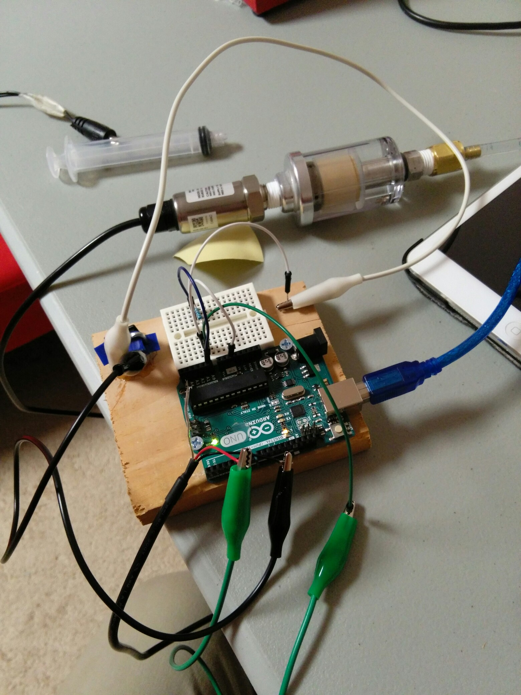
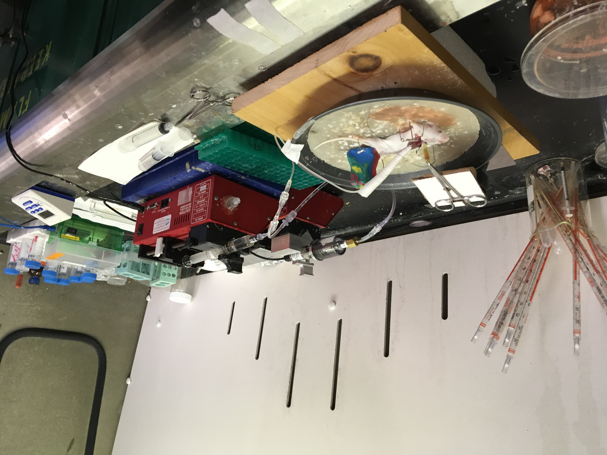

## Voltage Plotter and Logger

This project uses a computer connected to an Arduino Uno with an ATmega328p microcontroller to continuously read an analog voltage signal between 0V and 5V, as well as plots the voltage signal in real-time and saves the data recorded as a .csv file.

Note: As of now, this program only works on Windows.

### Installation
#### Set up Arduino:
1. Use the [Arduino IDE](https://www.arduino.cc/en/main/software) to upload VoltageMeter.ino to the Arduino Uno.
2. Connect the voltage to be measured to Pin A1.

#### Set up computer:
1. Install [PuTTY](https://www.chiark.greenend.org.uk/~sgtatham/putty/) if not already installed.
2. Open PuTTY, then:
	1. In the "Category" menu, select "Logging".
	2. Under "Session logging", select "All session output".
	3. Under "Log file name:", enter "C:\\Users\\\<your username here\>\\Desktop\\VoltageLog.csv" (replacing "\<your username here\>" with your Windows username).
	4. Under "What to do if the log file already exists", select "Always overwrite it".
	5. In the "Category" menu, select "Session".
	6. Under "Connection type", select "Serial".
	7. Under "Speed", enter 9600.
	8. Under "Serial line", enter the COM Port of the Arduino Uno.
	9. In the text field under "Saved Sessions", enter "ArduinoVoltageLogger".
	10. Press "Save" under "Load, save or delete a stored session".
	11. Exit PuTTY.
3. Install [Code Blocks](http://www.codeblocks.org/) if not already installed.
4. Open VoltagePlotter.cbp using Code Blocks.
5. Open main.cpp. On line 18, replace "\<your username here\>" with your Windows username.
6. Set the build target to "Release" and press "Build".
7. Go to .\\bin\\Release, and copy VoltagePlotter.exe to C:\\Program Files\\VoltagePlotter .
8. Create a Start Menu shortcut to C:\\Program Files\\VoltagePlotter\\VoltagePlotter.exe for easy access.

### Instructions for Use

The software creates and writes data to a file named "VoltageLog.csv" on the desktop. When the program starts, it will check to see if there is already a file named "VoltageLog.csv" on the desktop. If so, it will prompt the user whether to overwrite the file or not, as shown in the following image: 

If "Yes" is selected, then the program will continue and overwrite the VoltageLog.csv file on the desktop. If "No" is selected, then the program will immediately quit with no effect on the VoltageLog.csv file.

Two windows will appear: the PuTTY window with the data sent from the Arduino and the Live Voltage Plot window. A line of text like "Time (seconds),Voltage (5/1024 volts)" should appear in the PuTTY window. When this happens, the system is ready to start logging the voltage signal.

To start logging the voltage signal, make sure that the PuTTY window is active, and press the 'S' key on the keyboard. The PuTTY window has two columns &mdash; the column on the left is the time in seconds, and the column on the right is the voltage values of the recorded signal. The Live Voltage Plot window displays the signal in real time. To stop logging the voltage signal, simply press the 'S' key on the keyboard again with the PuTTY window being active.

To quit the program, close both the PuTTY window and the Live Voltage Plot window.

### Examples

